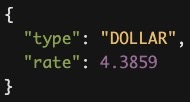

# BCV

## Example endpoints

- Dollar
  - [http://localhost:3002](http://localhost:3002/)
  - [http://localhost:3002/?type=DOLLAR](http://localhost:3002/?type=DOLLAR)
- Eur
  - [http://localhost:3002/?type=EUR](http://localhost:3002/?type=EUR)

### Example response

